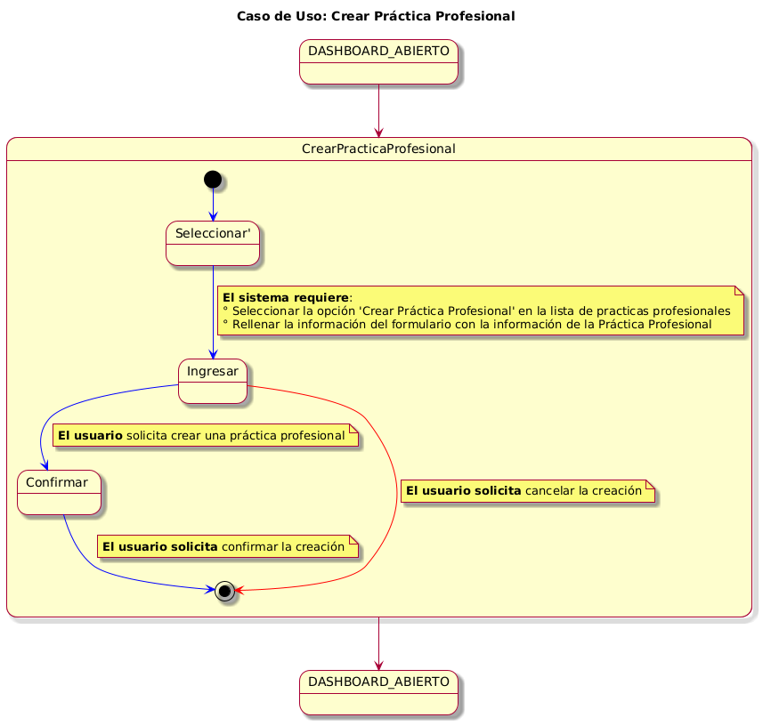
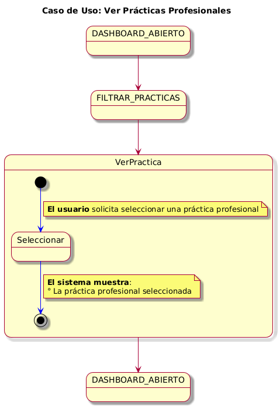
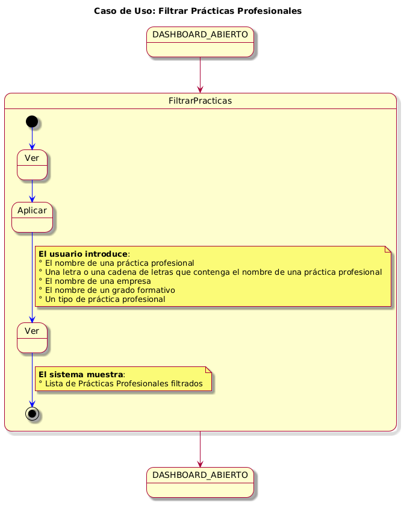
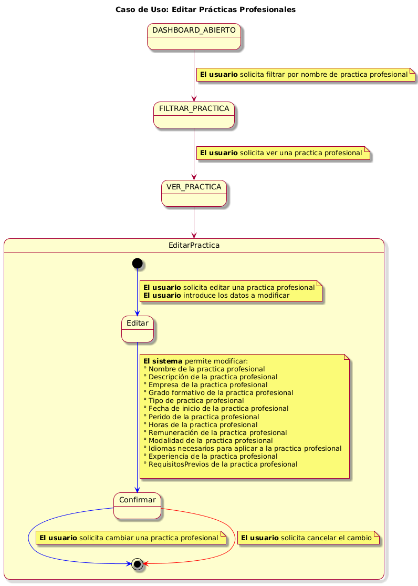
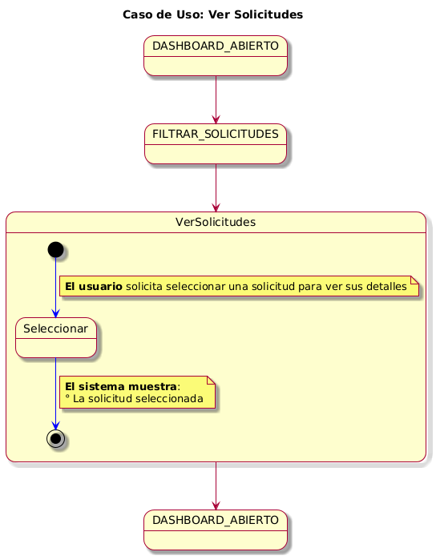
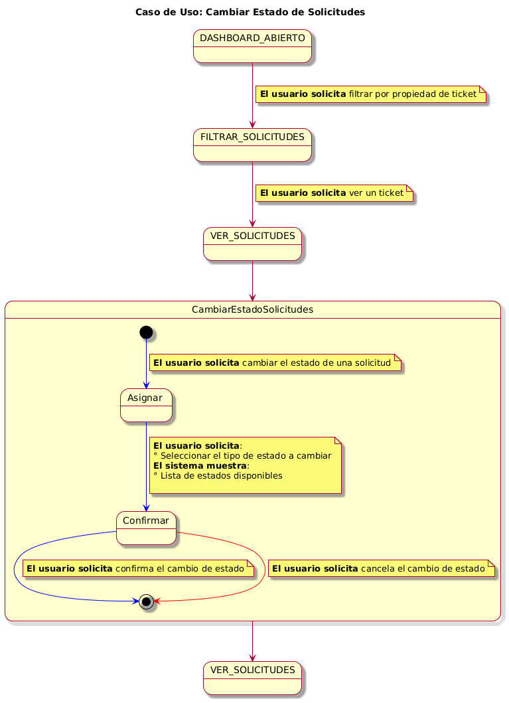

# Casos De Uso y Actores 📋

En este apartado se mostrará

## Actores Identificados

- Alumno
- Administrador

## Caso de Uso 💻

| Imagen | Código |
|--------|--------|
||[Código UML](../uml/cduCemu.puml)|

## Diagrama de Contexto 💻
### Administrador

| Imagen | Código |
|--------|--------|
||[Código UML](../uml/diagramaContexto.puml)|

### Alumno

| Imagen | Código |
|--------|--------|
||[Código UML](../uml/diagramaContextoAlumno.puml)|

## Casos de Uso detallados 💻
### Crear Prácticas Profesionales

Ver Diagrama

| Imagen | Código |
|--------|--------|
||[Código UML](../uml/CasosDeUsoDetallados/PracticasProfesionales/cduCrearPracticas.puml)|

### Ver Prácticas Profesionales

Ver Diagrama

| Imagen | Código |
|--------|--------|
||[Código UML](../uml/CasosDeUsoDetallados/PracticasProfesionales/cduVerPractica.puml)|

### Filtrar Prácticas Profesionales

Ver Diagrama

| Imagen | Código |
|--------|--------|
||[Código UML](../uml/CasosDeUsoDetallados/PracticasProfesionales/cduFiltrarPracticas.puml)|

### Editar Prácticas Profesionales

Ver Diagrama

| Imagen | Código |
|--------|--------|
||[Código UML](../uml/CasosDeUsoDetallados/PracticasProfesionales/cduEditarPracticas.puml)|

### Solicitud de Prácticas Profesionales (Alumno)

Ver Diagrama

| Imagen | Código |
|--------|--------|
||[Código UML]()|

### Ver Solicitud

Ver Diagrama

| Imagen | Código |
|--------|--------|
||[Código UML](../uml/CasosDeUsoDetallados/Solicitudes/cduVerSolicitudes.puml)|

### Cambiar Estado Solicitud

Ver Diagrama

| Imagen | Código |
|--------|--------|
||[Código UML](../uml/CasosDeUsoDetallados/Solicitudes/cduCambiarEstadoSolicitudes.puml)|

[Volver](../../README.md)