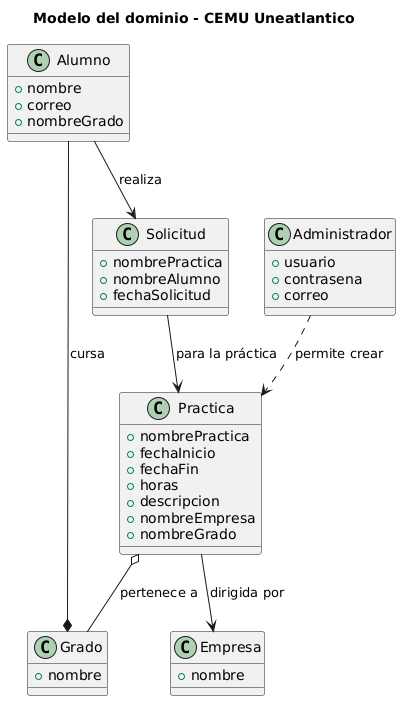
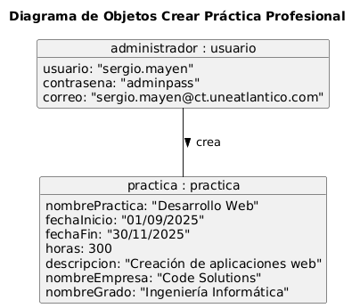
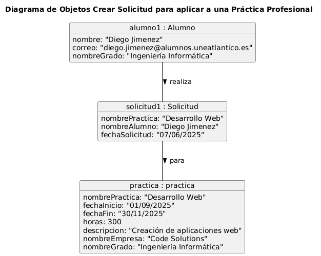
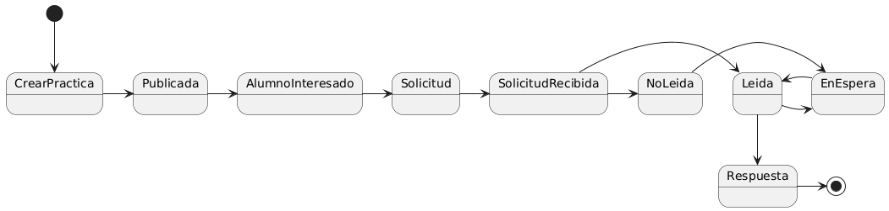
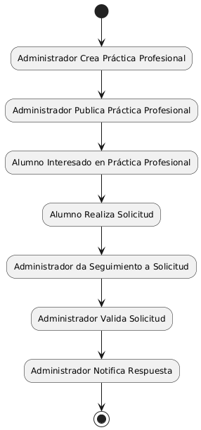

# Modelo del Dominio - CEMU Uneatlantico

A continuación, se muestra la documentación que resulta fundamental para comprender el sistema **CEMU**.

## Diagrama de clases

| Imagen | Código |
|--------|--------|
||[Código UML](../uml/diagramaDeClases.puml)

# Diagrama de Objetos

## Crear Practica

| Imagen | Código |
|--------|--------|
||[Código UML](../uml/diagramaDeObjetos_CrearPractica.puml)|

## Crear Solicitud

| Imagen | Código |
|--------|--------|
||[Código UML](../uml/diagramaDeObjetos_SolicitudPractica.puml)|

# Diagrama de Estados

| Imagen | Código |
|--------|--------|
||[Código UML](../uml/diagramaDeEstado.puml)|

# Diagrama de Actividad

| Imagen | Código |
|--------|--------|
||[Código UML](../uml/diagramaDeActividad.puml)|

[Volver](../../README.md)